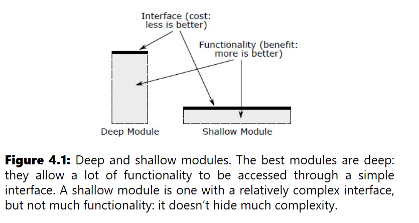

# Chapter 4: Modules Should Be Deep

a **Modules** can take many forms, such as classes, subsystems, or services. Higher-level subsystems and services are also modules; their interfaces may take different forms, such as kernel calls or HTTP requests. 

a **module** is any unit of code that has an interface and an implementation. 

Each class in an object-oriented programming language is a module. A class without dependencies can be a deep or shallow module.

## 4.2 What's in an interface?

An interface has **formal** and **informal** parts.

- **Formal**: explicitly specified in code; enforced by the language (method signatures, parameter types, return types, exceptions, public variables).
- **Informal**: described only in comments; not enforceable. Includes high-level behavior, side effects, and usage constraints (e.g., call order requirements).

> The informal aspects are typically larger and more complex than the formal ones.

- A clearly specified interface eliminates **"unknown unknowns"** — developers know exactly what they need to use the module, nothing more.

- The interfaces should be designed to make the **common case as simple as possible**.

- **Information hiding** reduces complexity in two ways. First, it simplifies the interface to a module. The interface reflects a simpler, more abstract view of the module’s functionality and hides the details; this reduces the cognitive load on developers who use the module.

- **Information leakage** occurs when the same knowledge is used in multiple places, such as two different classes that both understand the format of a particular type of file.

See: [C# example — ISessionStore](interface-example.md)

## 4.3 Abstractions

An **abstraction** is a simplified view of an entity that omits unimportant details. A module's interface is its abstraction.

Two failure modes:
- **Over-detailed**: includes unimportant details → increases cognitive load.
- **False abstraction**: omits important details → looks simple but isn't; misleads the caller.

The goal: minimize what the caller needs to know. Only expose details that truly matter for correct use.

> File system example: block allocation is hidden (unimportant); flush-to-storage rules are exposed (important for crash safety).

See: [C# example — Good vs. Bad Abstraction](abstraction-example-csharp-example.md)

## Figure 4.1: Deep vs. Shallow Modules


## 4.4 Deep Modules

A **deep module** provides powerful functionality behind a simple interface. Depth = benefit (functionality) vs. cost (interface complexity). The best modules maximize functionality while minimizing interface surface. The benefit provided by a module is its functionality.

**Example — Unix I/O**: just 5 system calls (`open`, `read`, `write`, `lseek`, `close`) hide hundreds of thousands of lines dealing with disk layout, caching, permissions, scheduling, and device diversity. The interface hasn't changed even as implementations evolved radically.

**Example — Garbage Collector** (Go/Java): has *no* interface at all — it invisibly reclaims memory, actually *shrinking* the system's overall interface by removing the need for manual `free`.

## 4.5 Shallow Modules

A **shallow module** has interface complexity comparable to its implementation complexity — it hides almost nothing.

- Linked-list classes are shallow: the abstraction barely simplifies over direct manipulation.
- Wrapping a one-liner (`data.put(attribute, null)`) in a method *adds* complexity (a new interface to learn) with zero abstraction benefit.

> **Red Flag — Shallow Module**: when the cost of learning the interface negates the benefit of hiding internals. Small modules tend to be shallow.

## 4.6 Classitis

**Classitis** = the mistaken belief that "classes are good, so more classes are better." Breaking code into many tiny classes creates many interfaces that accumulate into high system-level complexity, plus verbose boilerplate.

## 4.7 Java vs. Unix I/O

Java I/O is a classitis example: opening a file for buffered object reading requires three wrapper objects (`FileInputStream` → `BufferedInputStream` → `ObjectInputStream`). Buffering should be the *default*, not an explicit opt-in — design interfaces for the **common case**.

Unix I/O does this well: sequential access is the default; `lseek` exists for random access but most developers never need to know about it. **Effective complexity = complexity of the commonly used features.**

## 4.8 Conclusion

Separate interface from implementation to hide complexity. Design modules to be **deep**: simple interfaces for common use cases, significant functionality underneath. This maximizes concealed complexity.

---

# Chapter 5: Information Hiding (and Leakage)

## 5.1 Information Hiding

Each module should encapsulate design decisions in its implementation, invisible through its interface. Hidden information includes data structures, algorithms, low-level details (page sizes), and higher-level assumptions (most files are small).

**Two complexity wins:**
1. **Simpler interface** — callers see an abstract view, reducing cognitive load (e.g., B-tree users don't think about fanout or balancing).
2. **Easier evolution** — changes to hidden information affect only the owning module (e.g., new TCP congestion control doesn't touch higher-level code).

> **`private` ≠ information hiding.** Getter/setter methods that expose private fields leak information just as much as public fields.

**Partial hiding** still has value: if a feature is only needed by a few callers and accessed through separate methods, it creates fewer dependencies than universally visible information.

## 5.2 Information Leakage

Information leakage = a single design decision reflected in multiple modules. Any change to that decision forces changes across all involved modules.

- **Interface leakage**: information visible in the interface (simpler interfaces correlate with better hiding).
- **Back-door leakage**: two classes share knowledge (e.g., both know a file format) without exposing it in interfaces — *more pernicious* because it's not obvious.

**Fix strategies:**
- Merge small, tightly-coupled classes into one.
- Extract shared knowledge into a new class — but only if it can provide a simple interface that abstracts the details.

> **Red Flag — Information Leakage**: the same knowledge is used in multiple places, such as two different classes that both understand the format of a particular type of file.

## 5.3 Temporal Decomposition

Temporal decomposition = structuring code by the time order of operations (read → modify → write → three classes). This often leaks information because the same knowledge is needed at different stages.

**Example**: a file-format app split into a reader class, a modifier class, and a writer class. Both reader and writer must understand the file format → information leakage. **Fix**: combine reading and writing into a single class; the modifier uses that class in both phases.

> **Red Flag — Temporal Decomposition**: execution order reflected in code structure. If the same knowledge is used at different points in execution, it gets encoded in multiple places.

**Guideline**: focus on *what knowledge* each module needs, not *when* tasks occur.

## 5.5–5.7 Examples

## Example: Too Many Classes (HTTP server)

Students split HTTP request handling into two classes: one to read the request from the network, another to parse the string. This is temporal decomposition — and both classes ended up understanding HTTP structure (e.g., `Content-Length` must be parsed during reading). Parsing code was duplicated.

**Fix**: merge into a single class that reads and parses. This isolates all format knowledge in one place and exposes one method instead of two.

**General theme**: making a class slightly larger often improves information hiding by:
1. Bringing together all code for a capability.
2. Raising the interface level (one method for the whole computation vs. three steps).

## Example: HTTP Parameter Handling

**Good decisions:**
- Merged parameters from URL query string and body — callers don't care where a parameter came from.
- Decoded URL encoding internally — callers get `"What a cute baby!"` not `"What+a+cute+baby%21"`.

**Bad (shallow) interface:**
```csharp
public Map<String, String> getParams() { return this.params; }
```
Exposes internal representation; callers must dig into the Map; any storage change breaks all callers.

**Better (deeper) interface:**
```csharp
public String getParameter(String name) { ... }
public int getIntParameter(String name) { ... }
```
Hides storage, handles type conversion, fewer dependencies.

## Example: Defaults in HTTP Responses

**Bad**: requiring callers to specify the HTTP protocol version on every response — they likely don't know the right value, and it leaks protocol details.

**Good**: the HTTP library sets the version automatically (it already has the request object) and provides a `Date` header by default.

**Defaults = partial information hiding**: in the common case, callers don't even know the defaulted item exists. Override via a special method only when needed.

> **Principle**: classes should "do the right thing" without being asked. The best features are the ones you get without knowing they exist.

**Anti-example — Java I/O**: buffering is universally desired but must be explicitly requested (`BufferedInputStream`). It should be the default.

> **Red Flag — Overexposure**: if the API for a commonly used feature forces users to learn about rarely used features, it increases cognitive load unnecessarily.

## 5.8 Information Hiding Within a Class

Apply information hiding *inside* a class too:
- Design private methods so each encapsulates some knowledge, hidden from the rest of the class.
- Minimize the number of places each instance variable is used — fewer access points = fewer internal dependencies.

## 5.9 Taking It Too Far

Don't hide information that callers genuinely need. If a module's behavior depends on configuration that varies by use case, expose those parameters. Auto-configuration is better when possible, but recognize when external tuning is necessary.

## 5.10 Conclusion

- Information hiding → deep modules: more functionality behind a simpler interface.
- Modules that hide little are shallow (thin functionality or fat interface).
- Design around **pieces of knowledge**, not execution order — avoid temporal decomposition.
- Encapsulate each piece of knowledge in exactly one module.

---

# Chapter 6: General-Purpose Modules are Deeper

> **Core thesis**: Over-specialization is the single greatest cause of software complexity. General-purpose code is simpler, cleaner, and easier to understand.

## 6.1 Make Classes Somewhat General-Purpose

The **sweet spot**: implement modules in a *somewhat* general-purpose fashion.
- Functionality should reflect current needs.
- Interface should be general enough to support multiple uses — not tied specifically to today's use case.
- "Somewhat" matters: don't over-generalize to the point it's hard to use for current needs.

Counter-intuitive finding: general-purpose interfaces are *simpler and deeper* than special-purpose ones, and result in less total code — even when the class is only ever used in one specific way.

## 6.2–6.3 Text Editor Example

See: [General-Purpose vs. Special-Purpose Text API](text-editor-general-purpose-api-example.md)

**Key decision**: replace multiple special-purpose methods (one per UI action: `backspace`, `delete`, `deleteSelection`) with two general-purpose primitives (`insert(position, text)`, `delete(start, end)`) using a neutral `Position` type instead of UI-specific `Cursor`/`Selection`. This pushed all specialization upward into the UI layer and eliminated false abstractions.

## 6.4 Generality Leads to Better Information Hiding

- General-purpose API = clean separation between layers.
- The text class no longer needs to know how `backspace` behaves — that knowledge belongs in the UI.
- **False abstraction warning**: `backspace()` in the text class *looks* like it hides information, but the UI developer still needs to know which characters are deleted. Hiding it behind an interface just makes the information harder to reach.
- Rule: when details are important to the caller, make them *explicit and obvious*, not buried behind an abstraction.

## 6.5 Questions to Ask Yourself

1. **What is the simplest interface that covers all my current needs?** Fewer methods with the same capability = more general-purpose.
2. **In how many situations will this method be used?** A method designed for exactly one use is a red flag for over-specialization.
3. **Is this API easy to use for my current needs?** If you need a lot of extra code just to use the class, you've gone too far in the general direction (e.g., single-character insert/delete would require loops everywhere and be inefficient).

## 6.6 Push Specialization Up or Down

Specialization cannot be fully eliminated, but it should be **cleanly separated** from general-purpose code.

- **Push up**: specialized code lives only in top-level modules (e.g., UI code handles backspace behavior; text class stays generic).
- **Push down**: when a general interface must support many device types, push device-specific code into drivers/subclasses. The OS core stays generic; device drivers hold all specialization. This also makes adding new devices cheap: implement the interface, done.

## 6.7 Example: Editor Undo Mechanism

See: [Editor Undo Mechanism — General vs. Special-Purpose](editor-undo-mechanism-example.md)

**Key decision**: extract the general-purpose history management into a standalone `History` class with a `History.Action` interface. Push action-specific undo/redo logic down into `Action` implementations (owned by whatever module understands each operation); push grouping policy up into high-level UI code via `addFence()`. Once that separation was made, the rest fell out naturally — no callbacks between text class and UI, and adding a new undoable entity requires only a new `Action` class with no changes to `History`.

## 6.8 Eliminate Special Cases in Code

See: [Eliminating Special Cases — Text Selection](eliminate-special-cases-example.md)

**Key decision**: represent "no selection" as an empty range (start == end) instead of a boolean `exists` flag. Design normal-case operations (`delete`, `extract`) to handle an empty range correctly by producing a no-op — the edge case disappears entirely, and every guard scattered across the codebase goes with it.

> **Principle**: wherever a "nothing" state exists, ask whether an empty/zero value of the normal type can represent it instead of a separate flag. Design the normal-case code to handle that value correctly, and the special case ceases to exist.

> See Chapter 10 for reducing special cases in exception handling.

## 6.9 Conclusion

- Unnecessary specialization — in class/method design or in code (special-case if-chains) — is a primary driver of complexity.
- Reducing specialization produces: deeper classes, better information hiding, simpler and more obvious code.
- Separate what is unavoidably special-purpose from what can be general-purpose.

---

# Chapter 7: Different Layer, Different Abstraction

In a well-designed system, each layer provides a **different abstraction** from the layers above and below it. If adjacent layers have similar abstractions, this is a red flag suggesting a problem with the class decomposition.

**Examples of proper layering:**
- **File system**: file abstraction (variable-length byte array) → in-memory block cache (fixed-size blocks) → device drivers (block transfer to/from storage).
- **TCP**: reliable byte stream → best-effort bounded-size packets.

## 7.1 Pass-Through Methods

A **pass-through method** does little except invoke another method whose signature is similar or identical.

- Makes classes shallower: increases interface complexity without increasing total functionality.
- Creates coupling: signature changes in the lower class force matching changes in the upper class.
- Signals confused division of responsibility — the interface to a piece of functionality should live in the same class that implements it.

> **Red Flag — Pass-Through Method**: a method that does nothing except pass its arguments to another method, usually with the same API. This typically indicates there is not a clean division of responsibility between the classes.

> **Key Decision — Pass-Through Methods**: When a class forwards most calls to another class with the same signature, the division of responsibility is wrong. Fix by exposing the lower class directly, redistributing functionality, or merging classes — whichever produces coherent, non-overlapping abstractions.

See: [Pass-through methods — TextDocument example](./pass-through-methods-example.md)

## 7.2 When Is Interface Duplication OK?

Methods with the same signature are fine when each contributes **significant, distinct functionality**.

- **Dispatcher**: uses arguments to select one of several methods to invoke; passes most or all arguments to the chosen method. The selection logic itself is the valuable functionality. **Example**: a web server dispatches incoming HTTP requests by URL to different handlers (file serving, PHP, JavaScript).
- **Multiple implementations of the same interface**: e.g., disk drivers in an OS — each supports a different device but shares a common interface. Reduces cognitive load; once you learn one, you know them all. These methods are usually in the same layer and don't invoke each other.

## 7.3 Decorators

A **decorator** (wrapper) takes an existing object and extends its functionality, providing a similar or identical API. Methods invoke the methods of the underlying object.

- **Example**: Java's `BufferedInputStream` decorates `InputStream` with buffering; `ScrollableWindow` decorates `Window` with scrollbars.
- Decorator classes tend to be **shallow**: large amount of boilerplate for a small amount of new functionality, often containing many pass-through methods.
- Overuse leads to an explosion of shallow classes (Java I/O is the textbook example).

**Before creating a decorator, consider:**
1. Add the functionality directly to the underlying class — especially if it is general-purpose, logically related, or used by most callers (e.g., buffering belongs inside `InputStream`).
2. Merge the functionality with the use case rather than creating a separate class.
3. Merge with an existing decorator → one deeper decorator instead of multiple shallow ones.
4. Implement as a stand-alone class independent of the base class (e.g., scrollbars independent of the window).

> Wrappers make sense when translating between an external class's interface and a different required interface — but this situation is rare.

## 7.4 Interface vs. Implementation

The interface of a class should normally be **different from its implementation** — internal representations should differ from interface abstractions. If they are similar, the class probably isn't deep.

- **Example — Text editor**: teams that stored text as lines *and* exposed a line-oriented API (`getLine`, `putLine`) produced shallow classes. Higher-level UI code had to split and join lines manually — nontrivial, duplicated logic scattered across the codebase.
- A **character-oriented interface** (`insert(position, text)`, `delete(start, end)`) encapsulates line splitting/joining inside the text class, making it deeper and simplifying all callers. The API is quite different from the line-oriented storage — the difference represents valuable functionality.

## 7.5 Pass-Through Variables

A **pass-through variable** is passed down through a long chain of methods but only used by a low-level method deep in the chain.

- Forces all intermediate methods to be aware of the variable, even though they have no use for it.
- Adding a new pass-through variable requires modifying many interfaces and methods.

**Elimination strategies:**
1. **Shared object**: if a shared object already exists between the top and bottom methods, store the information there (but the object itself may be a pass-through variable).
2. **Global variable**: avoids method-to-method passing but prevents creating multiple independent instances in the same process.
3. **Context object** (preferred): a single object that stores all application global state (configuration, shared subsystems, performance counters). One context per system instance, supporting multiple instances in one process.

## 7.6 Conclusion

- Each layer in a system should provide a different abstraction; adjacent layers with similar abstractions signal decomposition problems.
- Pass-through methods, decorators, and pass-through variables are symptoms of insufficient abstraction differentiation.
- Fix by exposing, redistributing, merging, or introducing a context object — whichever gives each layer a coherent, distinct abstraction.
