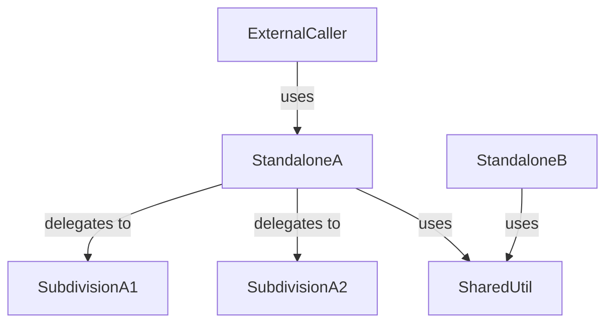

# Module Classification by Dependency Analysis

Receive a batch of C# files, analyze incoming and outgoing calls for every class, and classify each class as a **standalone module**, **subdivision/helper**, or **shared infrastructure**. When a dependency is not in the provided files, scan the codebase transitively until the full dependency chain is mapped.

> This skill is C#-oriented. Adapt terminology when reviewing other languages.

## Definitions

### Standalone Module (Parent Module)
A class that presents its own meaningful interface to external consumers and hides its implementation behind it. External code depends on it; it orchestrates or delegates to subdivisions that callers never see.

### Subdivision / Helper
A class that exists only to serve a standalone module. It has no independent external consumers and would not make sense on its own. It is part of a standalone module's hidden implementation.

### Shared Infrastructure
A class consumed by multiple standalone modules — cross-cutting utilities like retry logic, logging, base classes, or extension methods. Neither a standalone module nor a subdivision of one specific module.

### External Dependency
A class or interface from a NuGet package, framework library, or code outside the analyzed workspace. Tracked but not classified.

## Procedure

### Step 1 — Read all provided files

Read every file in the batch. For each class/interface/record found, record:

| Field | What to capture |
|-------|-----------------|
| **Class name** | Fully qualified if ambiguous |
| **File path** | Source file |
| **Public members** | Methods, properties, events, constructors |
| **Outgoing calls** | Classes this class depends on (constructor injection, field types, method calls, base classes, implemented interfaces) |
| **Incoming calls** | Classes that depend on this class (callers, injectors, inheritors) — may require codebase scan |

### Step 2 — Discover dependencies outside the batch

For each outgoing dependency **not** found in the provided files:

1. **Try language server first**: Use `vscode_listCodeUsages` on the class name to locate its definition and usages across the workspace.
2. **Fallback to text search**: If the language server is unavailable or returns no results, use `grep_search` for the class name, then `file_search` for likely file names (e.g., `**/ClassName.cs`).
3. **Read the discovered file** and add it to the analysis set.
4. **Repeat transitively**: if the newly discovered class has outgoing dependencies not yet analyzed, discover those too.
5. **Stop conditions**:
   - The dependency is from a NuGet package or .NET framework → classify as **External Dependency** and stop.
   - The dependency is already analyzed → stop.
   - The dependency cannot be found after search → classify as **Unresolved** and stop.

> Keep a running set of analyzed classes to avoid infinite loops.

### Step 3 — Build the call graph

Construct a directed dependency graph:

- **Nodes**: every class discovered (from batch + transitive scan)
- **Edges**: `A → B` means class A depends on class B (outgoing call from A = incoming call to B)

### Step 4 — Discover incoming calls for batch classes

For each class **in the original batch**, find what calls it from **outside** the batch:

1. **Try language server**: Use `vscode_listCodeUsages` on the class name — look for references outside the currently analyzed files.
2. **Fallback to grep**: Search for the class name across `**/*.cs` files.
3. Record these external callers as incoming edges.

This step is critical: a class that appears to be a leaf in the batch might actually be a standalone module consumed by code outside the batch.

### Step 5 — Classify each class

Apply these rules in order:

```
1. Has external incoming calls (from outside the analyzed set)?
   → Candidate: STANDALONE MODULE

2. Has incoming calls from exactly ONE standalone module and no external callers?
   → SUBDIVISION of that standalone module

3. Has incoming calls from MULTIPLE standalone modules?
   → SHARED INFRASTRUCTURE

4. Has NO incoming calls at all (orphan)?
   → Flag as UNUSED or possible entry point (check for [ApiController], Program.cs, etc.)

5. Is from a NuGet package or .NET framework?
   → EXTERNAL DEPENDENCY
```

**Edge cases**:
- A class implementing an interface: classify the concrete class based on who consumes it (via the interface).
- A class only referenced via DI registration (Startup/Program.cs): trace the DI registration to find the consumer.
- Abstract base classes: classify based on who inherits and who consumes the inheritors.

### Step 6 — Validate classification

Review the classification for consistency:

- Every subdivision must belong to exactly one standalone module.
- If a "subdivision" is consumed by multiple standalone modules, reclassify as **shared infrastructure**.
- If a standalone module has zero subdivisions and zero hidden complexity, note it (may still be valid).
- If subdivision count greatly exceeds standalone module count, flag potential **classitis**.

## Output Format

```
## Module Classification: [file list or folder]

### Dependency Graph

[Show key relationships. Use text-based arrows or a mermaid diagram.]



### Classification Table

| Class | File | Classification | Belongs To | Incoming From | Outgoing To |
|-------|------|---------------|------------|---------------|-------------|
| ServiceX | ServiceX.cs | Standalone module | — | ExternalController | HelperA, HelperB, IRepo |
| HelperA | HelperA.cs | Subdivision | ServiceX | ServiceX | — |
| HelperB | HelperB.cs | Subdivision | ServiceX | ServiceX | SharedUtil |
| SharedUtil | SharedUtil.cs | Shared infrastructure | — | ServiceX, ServiceY | — |
| IRepo | IRepo.cs | External dependency | — | ServiceX | — |

### Discovery Log

[List classes discovered outside the original batch and how they were found.]

| Class | Found Via | File | Why Scanned |
|-------|-----------|------|-------------|
| SharedUtil | vscode_listCodeUsages → grep fallback | Utils/SharedUtil.cs | Outgoing dep from HelperB |

### Unresolved Dependencies

[Any classes that could not be located.]

| Class | Referenced By | Search Attempted |
|-------|--------------|-----------------|
| IExternalApi | ServiceX | grep **/*.cs — not found in workspace |

### Flags

- [ ] **Classitis** — subdivision count >> standalone module count
- [ ] **Orphan classes** — classes with no incoming calls
- [ ] **Circular dependencies** — A → B → A
- [ ] **Deep subdivision chains** — A → B → C → D (consider flattening)
```
